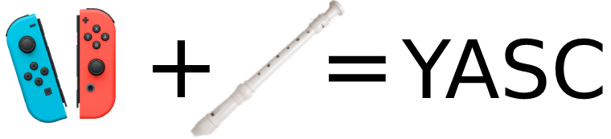

# YASC
The goal of the project is to to develop an interactive recorder performance tool, incorporating
Joy-Con controllers via a web interface for gesture-based inputs and SuperCollider for sound
synthesis.
<div>

<div>

## Requirements
+ node.js>=v16
+ SuperCollider software

## Dependency Installation

```bash
cd /server
npm install
```
## Connect Joy-Con to your PC
+ Connect your Joy-Con controllers to PC via Bluetooth, click the button below util your PC find and connect it.
<div>

<div>

##  and Run the whole system
1. Run server first.
```bash
node /server/index.js
```
2. Open the address shown in console. http://127.0.0.1:8081/
3. Open the files in /supercollider in SuperCollider and run relative codes.
4. Follow the instructions on website and enjoy.

## Detailed Description

