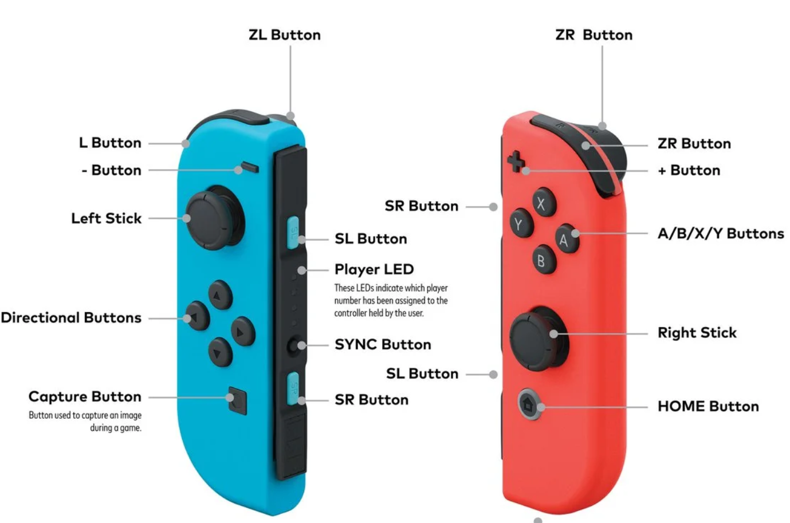
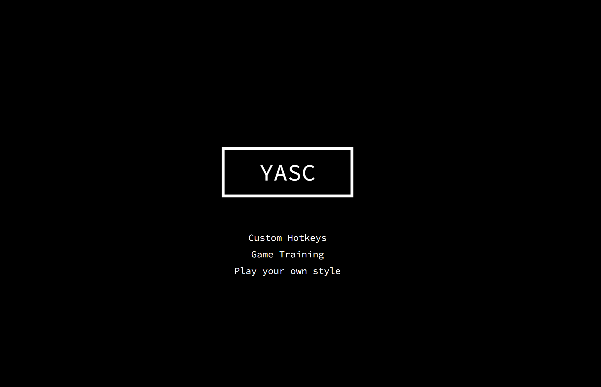

# YASC
The goal of the project is to to develop an interactive recorder performance tool, incorporating
Joy-Con controllers via a web interface for gesture-based inputs and SuperCollider for sound
synthesis.
<div>

<div>

## Video Introduction
https://youtu.be/8TOCC7nVZ_Q

## Requirements
+ Node.js>=v16
+ SuperCollider software
+ Latest Edge (fully tested)

## Dependency Installation

```bash
cd /server
npm install
```
## Connect Joy-Con controllers
Connect your Joy-Con controllers to PC via Bluetooth: click the button below until your PC detects and connects them.
<div>

<div>

## Introduction of Joy-Con controllers
Joy-Con controllers consist of two individual units, each containing an analog stick, an array of buttons, a gyroscope and motion sensors (accelerometers). In this project, the left controller is used to control synthesis parameters and the right one is responsible for playing notes.
<div>

<div>

## Run the website and SuperCollider
1. Run server first.
```bash
node /server/index.js
```
2. Open the address shown in console. http://127.0.0.1:8081/
3. Open the files in /supercollider in SuperCollider and run the relative code.
4. Follow the instructions on website and enjoy.

## Overall Structure
The system tracks interaction with Joy-Con controllers and use their serial messages as input. The web system acts as the central interface, providing
users with an intuitive and interactive tool to set up and customize their performance experience. SuperCollider serves as sound synthesis engine: it generates the sound according to the commands sent from web system via Open Sound Control (OSC) protocol. Finally, the audio output can be captured by web system to provide a visual feedback.      
<div>

<div>

## Website Introduction
+ Welcome to our home page! On this page, you'll find three links to different functions.
+ <b>Clicking on the logo</b> allows you to connect your controllers to the web system.
+ You can also connect via <b>game-pad icon</b> on the top-left in "different function" page.
<div>

<div>

+ Hotkey page: an interface to personalize your recorder experience. Through this page, Joy-Con controller buttons can be mapped to different functions.
+ The left controller is responsible for adjusting synthesis parameters in SuperCollider while the right controller is dedicated to play notes. 
+ Additionally, each motion of the Joy-Con controller can be captured and shown in the middle of the page: in this way, you can visually test the working condition of your devices. 
<div>

<div>

+ The dino game page: it serves as an interactive training tool designed to <b>help users
   familiarize themselves with their custom hotkeys.</b> The key point in our implementation is that
   the jumping action is triggered only through the correct Joy-Con button that the user has
   previously mapped in the Hotkey Page. Please note that as the game progresses, the speed increases, making it more challenging.
<div>

<div>

<div>

<div>

+ The performance page: it provides an immersive audio-visual experience by representing sounds as visual spectra.
+ Following the instructions, click the button and share the entire screen and system audio.
+ Additionally, we prepare a short mario audio for beginners to follow.
<div>

<div>
<div>

<div>
<div>

<div>

## SuperCollider introduction
+ The recorder sound is generated by SuperCollider. Here's the simple GUI where you can edit some synthesis parameters and see the changes performed through Joy-Con controllers. 
<div>

<div>

## Group: Algorhythmics
+ Alice Sironi
+ Cecilia Raho
+ Stefano Ravasi
+ Yan Zhuang

